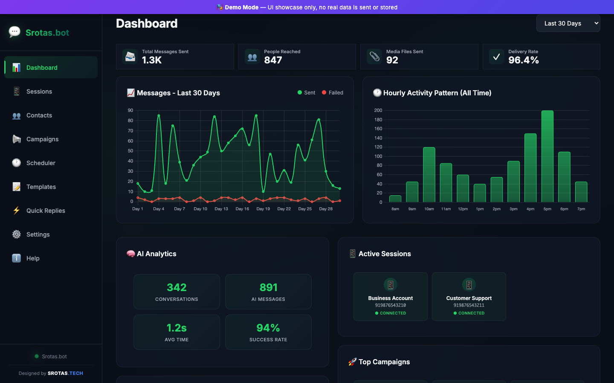
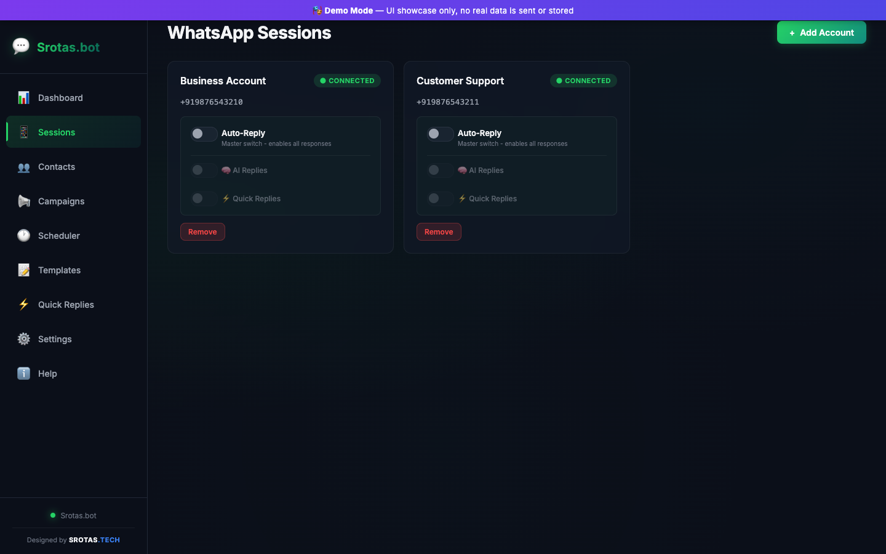
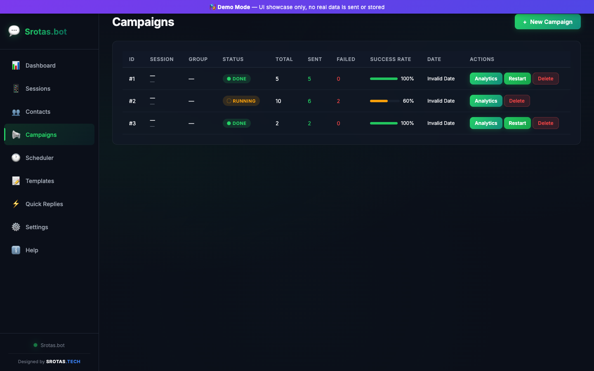
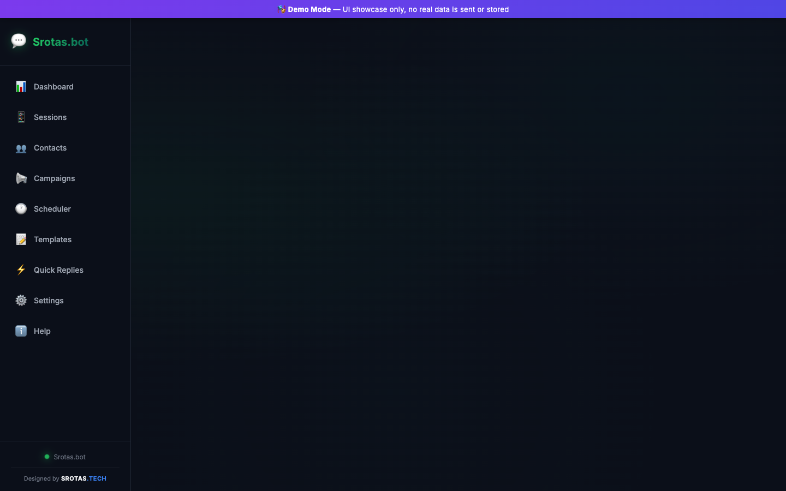

# Srotas.bot - Advanced WhatsApp Business Automation

Srotas.bot is an elite, self-hosted WhatsApp automation and marketing platform designed to help businesses scale their communication. Built for performance and beautifully designed, it offers a complete suite of tools to manage sessions, launch campaigns, create interactive templates, and utilize AI-driven auto-replies.

## 🚀 Key Features

*   **Multi-Session Management:** Connect and manage multiple WhatsApp numbers from a single unified dashboard. Securely link devices via QR code.
*   **Bulk Messaging Campaigns:** Send thousands of personalized messages using CSV contact imports, variable replacements (`{{name}}`, `{{company}}`), and real-time progress tracking.
*   **AI Auto-Responder & Quick Replies:** Automate your customer support using Gemini or OpenAI. Set up exact keyword-based quick replies or let the AI handle context-aware conversations.
*   **Interactive Templates:** Create rich message templates with media attachments (images, videos, PDF documents) and clickable interactive buttons.
*   **Advanced Analytics:** Track your message delivery rates, read receipts, and AI performance through a stunning, real-time Chart.js dashboard.
*   **Smart Scheduling:** Plan your broadcast campaigns in advance with precise date, time, and timezone scheduling.

---

## 📸 Product Showcase

### 📊 Real-Time Analytics Dashboard
Track everything at a glance. The dashboard provides insight into total messages sent, delivery rates, hourly heatmaps, and top-performing campaigns.

### 📱 Multi-Session Manager
Securely connect multiple WhatsApp accounts. Toggle Auto-Replies, AI features, and Quick Replies on a per-session basis instantly.

### 🚀 Campaign Broadcasting
Launch bulk messaging campaigns with robust error handling, detailed delivery status reports (Sent, Queued, Failed), and the ability to export analytics or retry failed messages.

### ⚡ AI & Auto-Responders
Configure keyword triggers for instant quick replies across different groups, ensuring your customers always get an immediate response.

